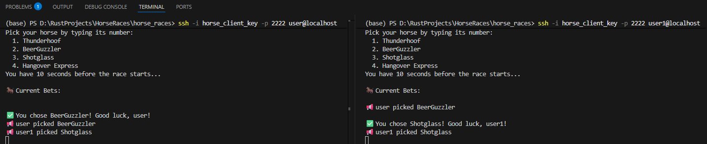
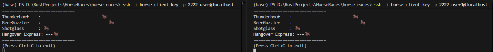

# 🐎 Last Call Derby

**Last Call Derby** is a multiplayer, terminal-based horse-racing game that runs entirely over SSH.
Players connect from their terminals, pick their favorite horses, chat in real time, and watch them race across the screen — all rendered live with colorful ANSI effects.

---

## 🎮 Gameplay Overview

Each player joins the arena using their SSH username, which becomes their in-game name.
Every round begins with a short betting phase, followed by a live race animation and the results.

**How it plays:**

* Connect to the server over SSH
* Choose your horse by typing its number
* Chat with other players while waiting for the race
* Watch your horse sprint toward victory
* Celebrate (or drink) based on the results

---

## 🧑‍🤝‍🧑 Multiplayer Features

* Each player’s **SSH username** is displayed as their racing name
* Real-time **bet announcements** and **chat messages**
* A shared **betting board** before every race shows everyone’s picks
* Races are **animated live** with a full-screen track view
* Winners are **announced to all players** with automatic drink penalties for non-bettors

---

## 🏇 Horses of the Derby

* Thunderhoof
* BeerGuzzler
* Shotglass
* Hangover Express

Every race selects a random winner — fortune favors the bold.

---

## 🧩 Built With

* **Rust** for performance and concurrency
* **Tokio** for async event handling
* **russh** for SSH-based multiplayer
* **rand** for randomized race outcomes
* **ANSI cursor control** for terminal animations

---

## 🏆 Highlights

* Fast-paced races every 30 seconds
* Multiplayer betting with live updates
* Automatically uses your SSH login name
* Colorful terminal graphics and racing effects

---

## 📸 Screenshots

| Horse Selection       | Race in Progress      |
| --------------------- | --------------------- |
|  |  |

---

## 🍻 Credits

Created as a terminal party game for developers who love Rust, racing, and rivalry.
Grab a drink, place your bets, and let the **Last Call Derby** begin.
